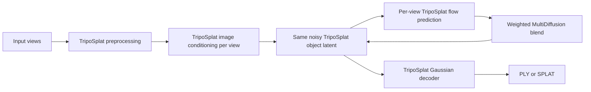

# Architecture and model provenance

## What generates the splat

TripoSplat generates and decodes every output. The active learned components
are the TripoSplat image encoders, flow-matching model, object latent, learned
camera token, Gaussian decoder, and export representation.

TRELLIS model weights, structured latents, sparse decoders, and Gaussian
decoder are not loaded.

## What is adapted from TRELLIS 1

The implementation adapts TRELLIS 1's tuning-free multi-image sampling idea:
at each denoising step, evaluate the same noisy object latent once per image,
blend the conditional predictions, perform classifier-free guidance with one
negative prediction, and update one shared latent.

## TripoSplat-specific camera handling

TripoSplat jointly predicts an object latent and a five-channel camera token.
The checkpoint does not document those five channels as literal XYZ or camera
angles. This fork therefore keeps one independently denoised camera state per
image and never injects hand-authored direction vectors.

Guided view labels influence only the blend schedule:

- a Front-ish or first guided image is stronger during early shape formation;
- all guided views remain active;
- free-angle influence increases during later detail refinement;
- in free-only mode, the first arbitrary view is the early orientation anchor
  and weights converge to equal averaging late in sampling.

## Sampling modes

### MultiDiffusion

Every image is evaluated at every step. This is the recommended consistency
mode. Runtime grows approximately with the number of images.

### Stochastic

One image is selected per step according to a deterministic balanced schedule.
It is faster, but typically less consistent. The sampler guarantees every view
is visited by raising the effective step count when needed.

## Reproducibility

Each view uses the same seeded VAE posterior-noise realization so image order
does not introduce arbitrary encoder noise. Sampling uses a separately reset
generator with the same user seed.

## Limitations

This is a tuning-free adaptation rather than a model trained on registered
multi-view sets. It cannot guarantee perfect reconstruction for inconsistent
inputs, deforming subjects, major lighting changes, occlusions, or views that
share too little visible structure.
